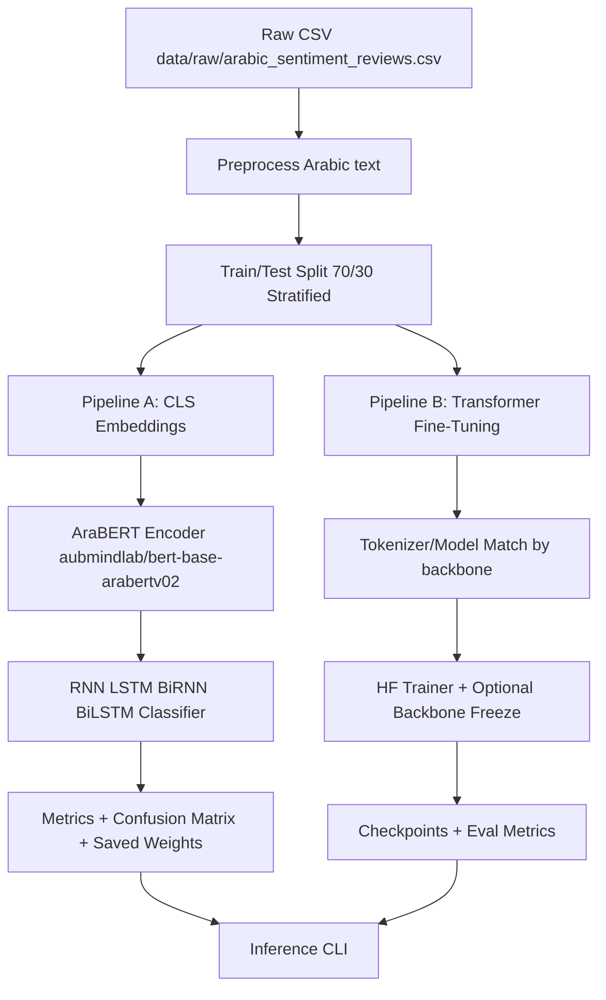

# Arabic Sentiment Text Classification

Arabic sentiment classification with two training pipelines:

1. Embeddings pipeline: `AraBERT CLS embeddings -> RNN/LSTM/BiRNN/BiLSTM`.
2. Fine-tuning pipeline: Hugging Face `Trainer` for `AraBERT` (and optional `mBERT` baseline).

This repository is modular, reproducible, and designed for practical experimentation and deployment workflows.

## Dataset

The dataset must be downloaded manually and placed locally:

- Kaggle dataset: https://www.kaggle.com/datasets/abdallaellaithy/330k-arabic-sentiment-reviews
- Expected file name: `arabic_sentiment_reviews.csv`
- Expected local path: `data/raw/arabic_sentiment_reviews.csv`
- Required columns: `content`, `label`

## Architecture



## Quickstart

### 1) Environment

```bash
python -m venv .venv
source .venv/bin/activate
pip install -r requirements.txt
```

### 2) Place dataset locally

```text
data/raw/arabic_sentiment_reviews.csv
```

### 3) Run embeddings + RNN variants

```bash
python -m src.train.train_rnn --config src/config/embeddings_rnn.yaml
```

Outputs:
- Embeddings: `outputs/embeddings/`
- Models: `outputs/models/`
- Metrics: `outputs/metrics/`
- Confusion matrix plots: `outputs/plots/`

### 4) Run transformer fine-tuning

```bash
python -m src.train.train_finetune --config src/config/finetune_bert.yaml
```

Outputs:
- HF run artifacts: `outputs/hf_runs/<run_name>/`

### 5) Run inference

Embeddings + RNN:

```bash
python -m src.infer.predict \
  --pipeline embeddings_rnn \
  --model_path outputs/models/bi_lstm_best.pt \
  --input_csv data/processed/sample_input.csv \
  --output_csv outputs/predictions_embeddings.csv
```

Fine-tuned transformer:

```bash
python -m src.infer.predict \
  --pipeline finetune \
  --model_path outputs/hf_runs/arabert_finetune/best_model \
  --input_csv data/processed/sample_input.csv \
  --output_csv outputs/predictions_finetune.csv
```

## Project Structure

```text
.
├─ README.md
├─ docs/
│  ├─ system-design.md
│  ├─ data-card.md
│  ├─ model-card.md
│  └─ experiments.md
├─ src/
│  ├─ config/
│  │  ├─ default.yaml
│  │  ├─ embeddings_rnn.yaml
│  │  └─ finetune_bert.yaml
│  ├─ data/
│  │  ├─ load_data.py
│  │  ├─ preprocess.py
│  │  └─ split.py
│  ├─ embeddings/
│  │  └─ build_bert_embeddings.py
│  ├─ models/
│  │  ├─ rnn_classifier.py
│  │  ├─ hf_dataset.py
│  │  └─ metrics.py
│  ├─ train/
│  │  ├─ train_rnn.py
│  │  └─ train_finetune.py
│  ├─ infer/
│  │  └─ predict.py
│  └─ utils/
│     ├─ seed.py
│     ├─ logging.py
│     └─ paths.py
├─ scripts/
│  ├─ run_train_rnn.sh
│  ├─ run_finetune.sh
│  └─ run_predict.sh
├─ tests/
│  ├─ test_preprocess.py
│  └─ test_infer_smoke.py
├─ requirements.txt
├─ Dockerfile
├─ .gitignore
└─ .github/workflows/ci.yml
```

## Reproducibility

- Centralized YAML configs under `src/config/`.
- Seed control in `src/utils/seed.py`.
- Deterministic-ish torch settings (cuDNN deterministic mode).
- Explicit label mappings and inference metadata persisted with trained models.


## Roadmap

1. Add hyperparameter sweeps and experiment tracking.
2. Add calibration and threshold tuning for deployment.
3. Add model packaging for serving (FastAPI/ONNX).
4. Add data drift checks and scheduled retraining jobs.

## References

- Kaggle dataset: https://www.kaggle.com/datasets/abdallaellaithy/330k-arabic-sentiment-reviews
- AraBERT model: https://huggingface.co/aubmindlab/bert-base-arabertv02
- mBERT model: https://huggingface.co/bert-base-multilingual-cased

